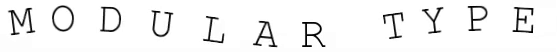

## About
Motion Graphics are often created using applications such as Cinema4D or Adobe After Effects. Although powerful, these applications can require long render times and heavy amounts of iteration. The purpose of Modular Type was to create a playful animation tool where users can experiment, see changes live, and produce visually pleasing kinetic typography. The animations are modulated by Triangle, Sawtooth, Sin and Square waveforms.

The project is built using Openframeworks, an open source C++ toolkit for creative coding

## Usage

## Installation
